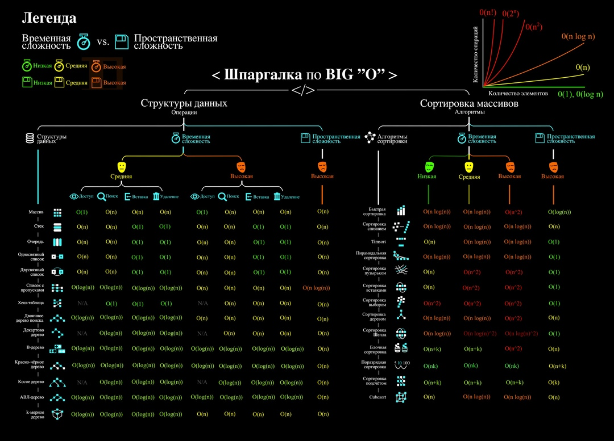
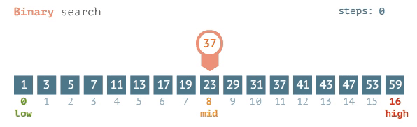
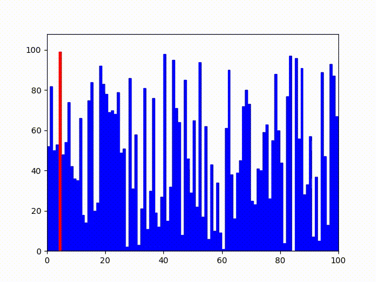
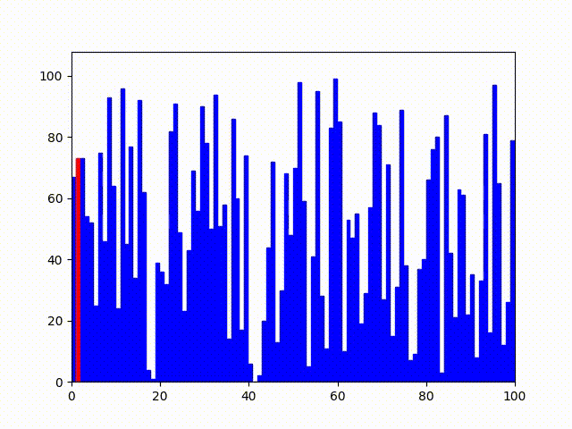
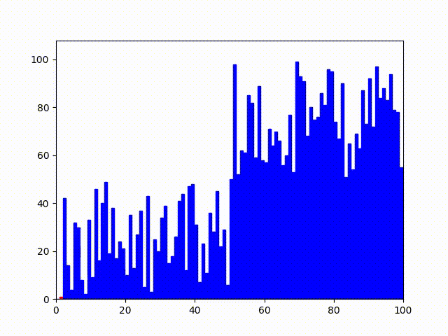

# **Базовая теория по алгоритмам с примерами**
---

### Временная сложность алгоритма
**Временная сложность алгоритма** - это мера количества времени, которое алгоритм затрачивает на выполнение в зависимости от размера входных данных. Она выражается в терминах количества элементарных операций (например, сравнений, присваиваний), выполняемых алгоритмом.
#### Основные концепции временной сложности
1. **Асимптотический анализ**

Временная сложность обычно выражается с использованием асимптотического анализа, который оценивает поведение алгоритма при больших размерах входных данных. Асимптотические обозначения включают:

- **O(f(n)) (Большое О)**: Верхняя граница времени выполнения. Гарантирует, что алгоритм выполняется не дольше, чем f(n) в худшем случае.
- **Ω(f(n)) (Большое Омега)**: Нижняя граница времени выполнения. Гарантирует, что алгоритм выполняется не быстрее, чем f(n) в лучшем случае.
- **Θ(f(n)) (Большое Тета)**: Точное асимптотическое время. Гарантирует, что алгоритм выполняется примерно как f(n) в среднем случае.

2. **Временная сложность различных алгоритмов**

Временная сложность разных алгоритмов может значительно различаться. Ниже приведены примеры временной сложности для некоторых распространенных алгоритмов:

- **O(1) (Константная сложность)**: Время выполнения не зависит от размера входных данных.
- **O(log n) (Логарифмическая сложность)**: Время выполнения увеличивается логарифмически с увеличением размера входных данных.
- **O(n) (Линейная сложность)**: Время выполнения увеличивается линейно с увеличением размера входных данных.
- **O(n log n) (Линейно-логарифмическая сложность)**: Время выполнения увеличивается пропорционально n x log(n).
- **O(n^2) (Квадратичная сложность)**: Время выполнения увеличивается пропорционально квадрату размера входных данных.
- **O(2^n) (Экспоненциальная сложность)**: Время выполнения увеличивается экспоненциально с увеличением размера входных данных.
- **O(n!) (Факториальная сложность)**: Время выполнения увеличивается факториально с увеличением размера входных данных.

### Пространственная сложность алгоритма
**Пространственная сложность алгоритма** — это мера количества памяти, которое алгоритм затрачивает во время своего выполнения в зависимости от размера входных данных. Она оценивает объем памяти, необходимый для хранения данных, переменных и вспомогательных структур, используемых алгоритмом.
#### Основные аспекты пространственной сложности
1. **Постоянная память**
Некоторые алгоритмы требуют фиксированного количества памяти, независимо от размера входных данных. Это называется константной пространственной сложностью и обозначается как O(1).
- Пример: Простое присваивание значения переменной или выполнение базовой арифметической операции требует фиксированного количества памяти.

2. **Линейная память**
Алгоритмы, которые требуют памяти, пропорциональной размеру входных данных, имеют линейную пространственную сложность и обозначаются как O(n).
- Пример: Копирование массива требует памяти, пропорциональной размеру массива, так как нужно создать новый массив той же длины.

3. **Квадратичная память**
Алгоритмы, которые требуют памяти, пропорциональной квадрату размера входных данных, имеют квадратичную пространственную сложность и обозначаются как O(n^2).
- Пример: Хранение двумерной таблицы (матрицы) для графа с n вершинами требует памяти, пропорциональной n^2, так как требуется хранить информацию о каждой паре вершин.

## **Шпаргалка по BIG O**

# Простейшие Алгоритмы
---
## Линейный поиск
**Линейный поиск (или последовательный поиск)** — это простой алгоритм поиска, который проверяет каждый элемент массива или списка последовательно до тех пор, пока не найдет искомый элемент или не закончится весь список.
Как работает линейный поиск:
1.Алгоритм начинает с первого элемента массива.
2.Каждый элемент массива последовательно сравнивается с искомым значением.
3.Нахождение элемента:
- Если элемент совпадает с искомым значением, алгоритм возвращает индекс этого элемента.
- Если элемент не совпадает, алгоритм переходит к следующему элементу.
4.Если все элементы проверены и искомый элемент не найден, алгоритм возвращает специальное значение (например, -1), указывающее на то, что элемент отсутствует в массиве, но необходимо быть с этим осторожным и проверять возвращаемое значение, так как например обращение по индексу -1 имеет смысл и будет обращаться к последнему элементу, что может быть не корректным в текущей задаче.

### **Временная сложность линейного поиска**

#### **Худший случай**
- В худшем случае искомый элемент находится в самом конце массива или вообще отсутствует. В этом случае алгоритму приходится проверить каждый элемент массива.
- Временная сложность: O(n), где n — количество элементов в массиве.

#### **Средний случай**
- В среднем случае алгоритм находит искомый элемент примерно после проверки половины элементов массива.
- Временная сложность: O(n), так как константы не учитываются в асимптотическом анализе.

#### **Лучший случай**
- В лучшем случае искомый элемент находится на первом месте в массиве.
- Временная сложность: O(1), так как алгоритм завершает работу после первой проверки.

### **Пространственная сложность линейного поиска**
- Линейный поиск не требует дополнительной памяти, кроме небольшой константной памяти для хранения индексов и временных переменных.
- **Пространственная сложность**: O(1).

### **Применение линейного поиска**
- **Массивы и списки**: Линейный поиск часто используется для небольших массивов и списков, где его простота перевешивает недостатки в производительности.
- **Неотсортированные данные**: Он особенно полезен, когда данные не отсортированы, так как не требует предварительной сортировки.
- **Поиск в структурах данных**: В некоторых структурах данных, где доступ к элементам невозможен через индекс (например, в связанных списках), линейный поиск может быть единственным доступным вариантом.

### **Преимущества и недостатки линейного поиска**

#### **Преимущества:**
- Простота реализации и понимания.
- Не требует предварительной обработки данных (например, сортировки).

#### **Недостатки:**
- Низкая эффективность на больших наборах данных.
- Время выполнения линейно зависит от размера массива, что может быть неприемлемо для больших объемов данных.

## Бинарный поиск

**Бинарный поиск** — это эффективный алгоритм поиска, который используется для нахождения элемента в отсортированном массиве. Алгоритм работает по принципу деления массива пополам, сравнивая искомое значение с серединным элементом и рекурсивно или итеративно сокращая область поиска.

**Как работает бинарный поиск**
1.Начало: Определяются начальные границы поиска — левые (low) и правые (high) индексы массива.
2.Середина: Вычисляется индекс среднего элемента (mid).
3.Сравнение: Искомое значение сравнивается с серединным элементом массива.
- Если элемент посередине равен искомому значению, алгоритм возвращает индекс этого элемента.
- Если искомое значение меньше среднего элемента, правая граница поиска сдвигается влево (high = mid - 1).
- Если искомое значение больше среднего элемента, левая граница поиска сдвигается вправо (low = mid + 1).
4.Повторение: Шаги 2 и 3 повторяются, пока не будет найден элемент или пока левая граница не превысит правую.
5.Конец поиска: Если элемент не найден, алгоритм возвращает специальное значение (например, -1), указывающее на то, что элемент отсутствует в массиве.

### **Временная сложность бинарного поиска**
#### **Худший случай**
- В худшем случае алгоритм делит область поиска пополам на каждом шаге до тех пор, пока не останется один элемент. Это происходит логарифмическое количество раз.
- Временная сложность: O(log n), где n — количество элементов в массиве.
#### **Средний случай**
- В среднем случае алгоритм также делит область поиска пополам на каждом шаге.
- Временная сложность: O(log n), так как асимптотическое поведение совпадает с худшим случаем.
#### **Лучший случай**
- В лучшем случае искомое значение находится посередине массива при первом сравнении.
- Временная сложность: O(1), так как элемент найден на первом шаге.

### **Пространственная сложность бинарного поиска**
- Бинарный поиск требует константного количества памяти для хранения индексов и временных переменных в итеративной реализации.
- Пространственная сложность: O(1) для итеративной версии и O(log n) для рекурсивной версии (из-за использования стека вызовов).

### **Преимущества и недостатки бинарного поиска**
#### **Преимущества**:

- Эффективность: Гораздо быстрее, чем линейный поиск для больших массивов, с временной сложностью O(log n).
- Простота реализации: Легко реализуется и понимание.

#### **Недостатки**:

- Требование сортировки: Массив должен быть отсортированным, что может потребовать дополнительных ресурсов.
- Не подходит для динамических данных: Менее эффективен, если данные часто изменяются, так как массив нужно будет сортировать после каждого изменения.
 
## **Сортировка пузырьком**
**Сортировка пузырьком** — это простой алгоритм сортировки, который работает по принципу многократного прохода по массиву. На каждом проходе сравниваются соседние элементы и меняются местами, если они расположены в неправильном порядке. Этот процесс продолжается до тех пор, пока массив не будет отсортирован.
#### **Как работает сортировка пузырьком**
1.Начало: Алгоритм начинает с первого элемента массива.
2.Сравнение: Каждый элемент сравнивается с соседним.
- Если текущий элемент больше следующего, они меняются местами.
3.Проходы по массиву:
- После каждого полного прохода самый большой элемент "всплывает" к концу массива.
- Процесс повторяется для оставшихся элементов, за исключением уже отсортированной части.
4.Повторение: Шаги 2 и 3 повторяются до тех пор, пока весь массив не будет отсортирован

### **Временная сложность сортировки пузырьком**
#### **Худший случай**
- Описание: В худшем случае массив уже отсортирован в обратном порядке, и алгоритму приходится делать максимальное количество сравнений и обменов.
- Временная сложность: O(n^2), где nnn — количество элементов в массиве.
#### **Средний случай**
- Описание: В среднем случае массив может быть в любом произвольном порядке, и алгоритму потребуется сравнивать и обменивать элементы на каждом проходе.
- Временная сложность: O(n^2).
#### **Лучший случай**
- Описание: В лучшем случае массив уже отсортирован. Алгоритм делает один проход и обнаруживает, что обмены не нужны.
- Временная сложность: O(n), если использовать флаг для отслеживания обменов.
 
### **Пространственная сложность сортировки пузырьком**
- Описание: Сортировка пузырьком не требует дополнительной памяти, кроме константного количества временных переменных для обменов.
- Пространственная сложность: O(1).
 
### **Преимущества и недостатки сортировки пузырьком**
#### **Преимущества:**

- Простота реализации и понимания.
- Подходит для небольших массивов или уже почти отсортированных массивов.
- Может быть использован для учебных целей для демонстрации базовых концепций сортировки.
#### **Недостатки:**

- Низкая эффективность на больших наборах данных.
- Время выполнения квадратично зависит от размера массива, что делает его непригодным для больших объемов данных.
- Существует много более эффективных алгоритмов сортировки для практического использования (например, быстрая сортировка, сортировка слиянием).

## **Сортировка вставками**
**Сортировка вставками** — это простой и интуитивно понятный алгоритм сортировки, который работает по принципу построения отсортированного массива один элемент за раз. Каждый новый элемент вставляется в уже отсортированную часть массива на правильное место.
 
### **Как работает сортировка вставками**
1. Начало: Алгоритм начинает с первого элемента массива, считая его отсортированным.
2. Выбор элемента: Следующий элемент выбирается для вставки в отсортированную часть массива.
3. Поиск места: Элемент сравнивается с уже отсортированными элементами, сдвигая их вправо, если они больше текущего элемента.
4. Вставка: Элемент вставляется на своё место.
5. Повторение: Шаги 2-4 повторяются для всех элементов массива, начиная со второго.

### **Временная сложность сортировки вставками**
#### **Худший случай**
- Описание: В худшем случае массив отсортирован в обратном порядке. Алгоритму нужно будет переместить каждый элемент на своё место в начале массива.
- Временная сложность: O(n^2), где nnn — количество элементов в массиве.
#### **Средний случай**
- Описание: В среднем случае элементы массива находятся в произвольном порядке, и каждый новый элемент нужно вставить в отсортированную часть массива.
- Временная сложность: O(n^2).
#### **Лучший случай**
- Описание: В лучшем случае массив уже отсортирован. Каждый новый элемент сразу оказывается на своём месте, без необходимости сдвигать другие элементы.
- Временная сложность: O(n), так как алгоритм выполняет только один проход без сдвигов.
 
### **Пространственная сложность сортировки вставками**
- Описание: Сортировка вставками не требует дополнительной памяти, кроме константного количества временных переменных для вставки.
- Пространственная сложность: O(1).
 
### **Преимущества и недостатки сортировки вставками**
#### **Преимущества:**

- Простота реализации и понимания.
- Эффективность для небольших массивов и почти отсортированных массивов.
- Стабильность: сохраняет относительный порядок элементов с одинаковыми ключами.
- Онлайн-алгоритм: может сортировать элементы по мере их поступления.

#### **Недостатки:**

- Низкая эффективность на больших наборах данных.
- Время выполнения квадратично зависит от размера массива, что делает его непригодным для больших объемов данных.

## **Быстрая сортировка**
**Быстрая сортировка (Quick Sort)** — это один из самых популярных и эффективных алгоритмов сортировки. Она используется благодаря своей высокой производительности на больших массивах данных и эффективному использованию памяти.
 
### **Основная идея алгоритма**
**Quick Sort использует подход "разделяй и властвуй":**

1. Выбор опорного элемента (**pivot**): Выбирается элемент, который будет использоваться для разделения массива.
2. Разделение массива: Все элементы, меньшие опорного, перемещаются в левую часть, а большие — в правую.
3. Рекурсивная сортировка: Алгоритм рекурсивно применяется к подмассивам слева и справа от опорного элемента.
 
### **Этапы работы Quick Sort**
1. Выбор опорного элемента (**pivot**):

- Можно выбрать любой элемент в качестве опорного (первый, последний, средний или случайный).
- Выбор случайного опорного элемента часто используется для предотвращения худшего случая.
2. Разделение (Partitioning):

- Массив реорганизуется так, чтобы элементы меньше опорного оказались слева, а элементы больше опорного — справа.
- После этого опорный элемент находится на своём окончательном месте.
3. Рекурсивная сортировка подмассивов:

- Процесс повторяется рекурсивно для подмассивов слева и справа от опорного элемента.

### **Временная сложность**
#### **Лучший случай**
- Описание: Происходит, когда массив на каждом шаге делится на две примерно равные части.
- Временная сложность: O(n log n)
#### **Средний случай**
- Описание: В среднем случае массив делится на части случайным образом, но близко к равным.
- Временная сложность: O(n log n)
#### **Худший случай**
- Описание: Происходит, когда массив делится на одну большую и одну маленькую часть (например, когда массив уже отсортирован, и опорный элемент всегда крайний).
- Временная сложность: O(n^2)
- Примечание: Худший случай можно избежать, если выбирать опорный элемент случайным образом.
 
### **Пространственная сложность**
- Описание: Quick Sort использует разделение массива на подмассивы, что требует дополнительной памяти для рекурсивных вызовов.
- Пространственная сложность: O(log n) из-за использования стека вызовов при рекурсии.
 
### **Преимущества и недостатки Quick Sort**
#### **Преимущества:**

- Высокая производительность на больших наборах данных.
- Легко реализуется и не требует дополнительной памяти для временных массивов (в итеративной версии).
- Широко используется в стандартных библиотеках сортировки.
#### **Недостатки:**

- Худший случай имеет временную сложность O(n^2), что можно избежать случайным выбором опорного элемента.
- Неустойчивость: порядок равных элементов может измениться.

## **Сортировка слиянием**
**Сортировка слиянием (Merge Sort)** — это эффективный и стабильный алгоритм сортировки, который использует принцип "разделяй и властвуй". Этот алгоритм является одним из наиболее популярных методов сортировки благодаря своей предсказуемой производительности и простоте реализации.

### **Основная идея алгоритма**
1. Разделение: Разделить массив на две половины.
2. Рекурсивная сортировка: Рекурсивно отсортировать каждую половину.
3. Слияние: Слить две отсортированные половины в один отсортированный массив.
 
### **Этапы работы Merge Sort**
1. Разделение:

- Массив делится на две равные части до тех пор, пока каждая часть не станет массивом с одним элементом.
2. Слияние:

- Два отсортированных массива сливаются в один отсортированный массив. Это делается путём сравнения элементов и добавления наименьшего в результирующий массив.

### **Временная сложность**
#### **Лучший случай**
- Описание: В лучшем случае массив всегда делится на две равные части.
- Временная сложность: O(n log n)
#### **Средний случай**
- Описание: В среднем случае массив делится на две равные части и рекурсивно сортируется.
- Временная сложность: O(n log n)
#### **Худший случай**
- Описание: В худшем случае массив делится на две равные части и рекурсивно сортируется.
- Временная сложность: O(n log n)
 
### **Пространственная сложность**
- Описание: Сортировка слиянием требует дополнительной памяти для временных массивов.
- Пространственная сложность: O(n) для хранения временных массивов.
 
### **Преимущества и недостатки Merge Sort**
#### **Преимущества:**

- Стабильность: Сортировка слиянием сохраняет порядок равных элементов.
- Производительность: O(n log n) производительность в худшем случае делает её предсказуемой и надёжной.
- Простота реализации: Алгоритм легко реализовать и понять.
#### **Недостатки:**

- Память: Требует дополнительной памяти O(n) для временных массивов.
- Не подходит для онлайн-сортировки: Нужно иметь все данные сразу, чтобы выполнить сортировку.
